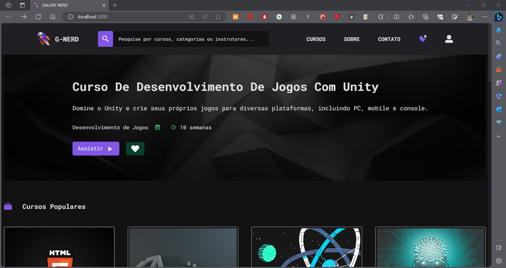

# Galaxy Nerd - Plataforma de E-learning com Inteligência Artificial



## Sobre o Projeto

Galaxy Nerd é uma plataforma de e-learning inovadora construída com ReactJS e alimentada por poderosas técnicas de Inteligência Artificial (IA). Nosso objetivo é revolucionar a forma como os estudantes aprendem, oferecendo uma experiência personalizada e enriquecedora.

## Recursos Principais

- Recomendações Inteligentes: Galaxy Nerd utiliza IA avançada para sugerir cursos com base no histórico de busca e preferências do estudante. Isso garante que cada usuário tenha acesso a conteúdo relevante e personalizado.

- Conexão com o Backend: Nossa plataforma é perfeitamente integrada com um robusto backend que armazena dados de cursos, usuários e interações. Isso garante um desempenho confiável e escalabilidade.

- Interface Intuitiva: A interface do Galaxy Nerd foi projetada para ser amigável e fácil de usar, proporcionando uma experiência de aprendizado sem atritos.

## Como Começar
Para começar a usar o Galaxy Nerd, siga estas etapas:

1. Clone este repositório para o seu ambiente de desenvolvimento local.

2. Instale as dependências executando ```npm install``` ou ```yarn install```.

3. Configure a conexão com o backend nos arquivos apropriados (consulte a documentação do backend para obter detalhes).

4. Inicie o aplicativo com npm start ou yarn start.

5. Acesse o aplicativo no seu navegador e comece a explorar o vasto mundo do conhecimento!

## Contribuição
Se você deseja contribuir para o desenvolvimento do Galaxy Nerd, estamos ansiosos para receber suas contribuições. Basta seguir as diretrizes de contribuição em nosso repositório e enviar suas solicitações de pull.

## Contato
Para obter mais informações sobre o Galaxy Nerd ou para entrar em contato conosco, pelo email: edilson@aluno.unilab.edu.br

Explore o universo do conhecimento com Galaxy Nerd - A plataforma de e-learning que coloca você no centro da aprendizagem!

